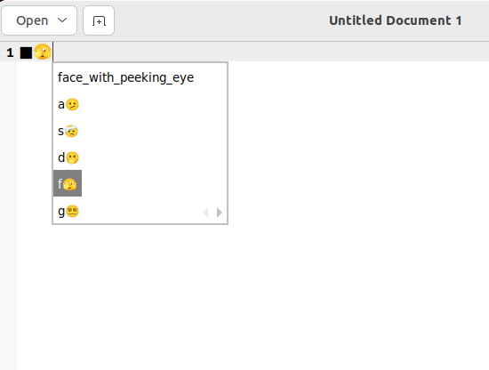

# 補完機能
CSKKには単純な補完機能があります。

辞書を補完に用いると設定し、見出し語入力状態で`Tab`を押し補完を始めると、送り仮名なしのエントリの中で見出し語の先頭が一致する候補を順に候補に出します。

例えば [絵文字辞書](https://github.com/uasi/skk-emoji-jisyo)を補完に用いると設定した状態で`/ f a Tab`と入力すると`face_exhaling`が補完され😮‍💨のような候補が表示され、Tabを押していくことで他の`fa`から始まる候補を選んでいけます。

