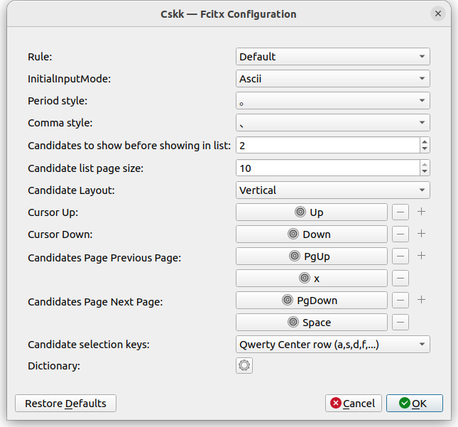

# fcitx5-cskkの設定

Fcitx5-cskkの設定はfcitx5-configtoolから行えます。

## Rule
変換規則。[cskkの設定](CSKK_configuration.md)を参照。

## InitialInputMode
初期の入力モード

## Period Style
句点の設定

## Comma Style
読点の設定

## Candidates to show before showing the list
変換候補が多数ある時、いくつの変換候補まではリスト表示せずに出すか

## Candidate list page size
変換候補をリスト表示する時、1ページにいくつ表示するか

## Candidate Layout
変換候補をリスト表示する時、どのように表示するか。

Vertical - 縦

Horizontal - 横

Not set - fcitx5の設定依存

## Cursor類
変換候補をリスト表示するとき、どのキーで操作するか。

## Candidate selection keys
変換候補をリスト表示している時、直接確定にはどのキーを用いるか。

## Dictionary
辞書設定

### Type
System - システム辞書。読み込み可能だが書き込みをしない辞書

User - ユーザ辞書。書き込みをする辞書。[CSKKの設定](CSKK_configuration.md)にある通り、ddskkとの互換性がないので他のSKKと共用する際は注意が必要。

### Encoding
辞書ファイルの文字コード。
UTF-8とeuc-jpは対応しています。他のものも多くの場合対応していますが、動作を保証しません。

過去の同様なアドオンから乗り変える際の互換性のため、"$FCITX_CONFIG_DIR"という文字列が行頭にある時のみFcitx5のアドオン標準設定ディレクトリに置き換えられます。新しく設定する時に使うことは推奨しません。Fcitx5のインストール時の設定に依存し、通常、XDG Data Directory内の fcitx5/cskk/ (例えば.local/share/fcitx5/cskk/など)になります。
